# Capstone Project: Stroke Prediction
By: Shuya Chen

## Executive Summary

### Background

Stroke is a disease that affects the arteries leading to and within the brain. It is the number five leading cause of death and disability in the United States. A stroke occurs when a blood vessel that carries oxygen and nutrients to the brain is either blocked by a clot or bursts. When that happens, part of the brain cannot get the blood and oxygen it needs, so brain cells die. Many people think a stroke happens in the heart, but it happens in the brain [(source)](https://www.stroke.org/en/about-stroke).

Risk Factors [(source)](https://www.mayoclinic.org/diseases-conditions/stroke/symptoms-causes/syc-20350113):

| Lifestyle                                                  | Medical                                | Other factors                                                                    |
|------------------------------------------------------------|----------------------------------------|----------------------------------------------------------------------------------|
| - Being overweight or obese                                | - High blood pressure                  | - Age: people age 55 or older have a higher risk of stroke than do younger people.|
| - Physical inactivity                                      | - Smoking or secondhand smoke exposure | - Race or ethnicity: African Americans and Hispanics have a higher risk of stroke than do people of other races or ethnicities.|
| - Heavy or binge drinking                                  | - High cholesterol                     | - Sex: men have a higher risk of stroke than do women. Women are usually older when they have strokes, and they're more likely to die of strokes than are men. |
| - Use of illegal drugs such as cocaine and methamphetamine | - Diabetes                             | - Hormones: use of birth control pills or hormone therapies that include estrogen increases risk.|
|                                                            | - Obstructive sleep apnea              |                                                                                  |
|                                                            | - Cardiovascular disease, including heart failure, heart defects, heart infection or irregular heart rhythm, such as atrial fibrillation ||
|                                                            | - Personal or family history of stroke, heart attack or transient ischemic attack |                                       |
|                                                            | - COVID-19 infection                   |                                                                                  |

### Problem Statement

This project aims to predict whether or not a person will have stroke. 

- build a reliable model to predict stroke
- reduce false negatives
- optimize recall score
- what features are important in predicting stroke 

### Data Import and Cleaning

This stroke dataset is from [Kaggle](https://www.kaggle.com/fedesoriano/stroke-prediction-dataset). The final dataset is clean and complete consisting of 4909 rows and 11 columns.

### Dataset Dictionary `stroke.csv`

|Feature          |Type  |Description                                     |
|-----------------|------|------------------------------------------------|
|gender           |object|patient's gender                                |
|age              |float |patient's age                                   |
|hypertension     |int   |if the patient has hypertension (1: yes, 0: no) |
|heart_disease    |int   |if the patient has heart disease (1: yes, 0: no)|
|ever_married     |object|if the patient has ever been married            |
|work_type        |object|patient's work type                             |  
|residence_type   |object|patient's residence type                        |
|avg_glucose_level|float |patient's average glucose level in blood        | 
|bmi              |float |patient's body mass index                       |
|smoking_status   |object|patient's smoking status                        |
|stroke           |int   |if the patient had a stroke (1: yes, 0: no)     |

### Exploratory Data Analysis

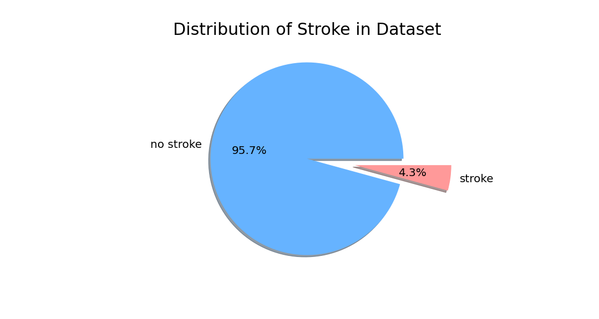

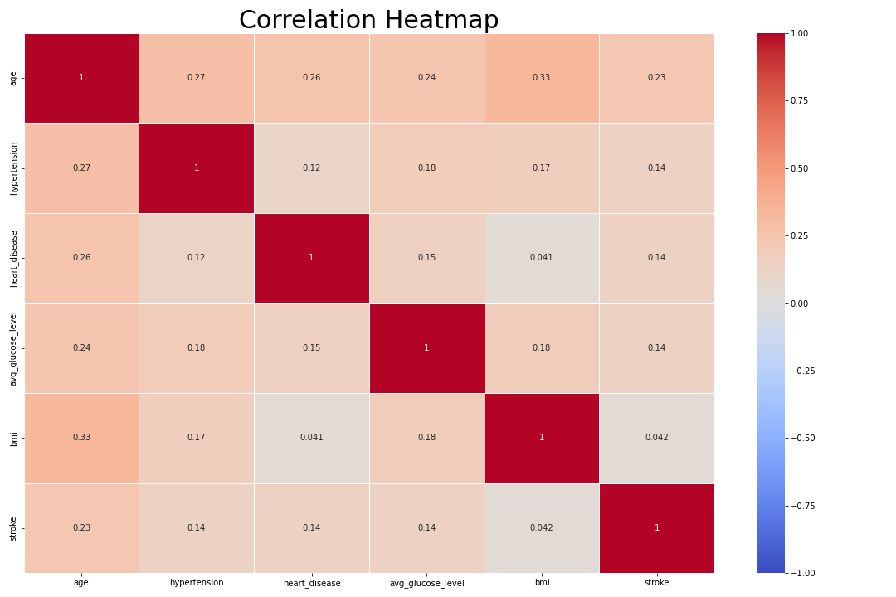

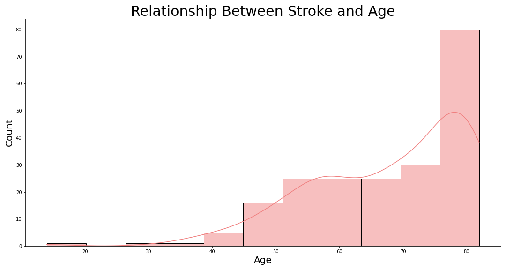

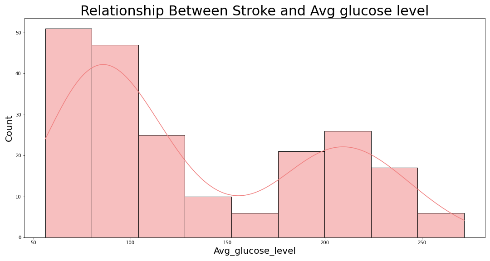

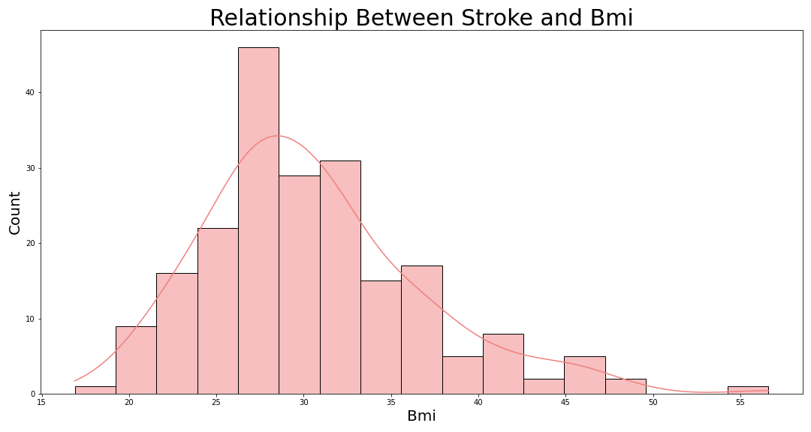

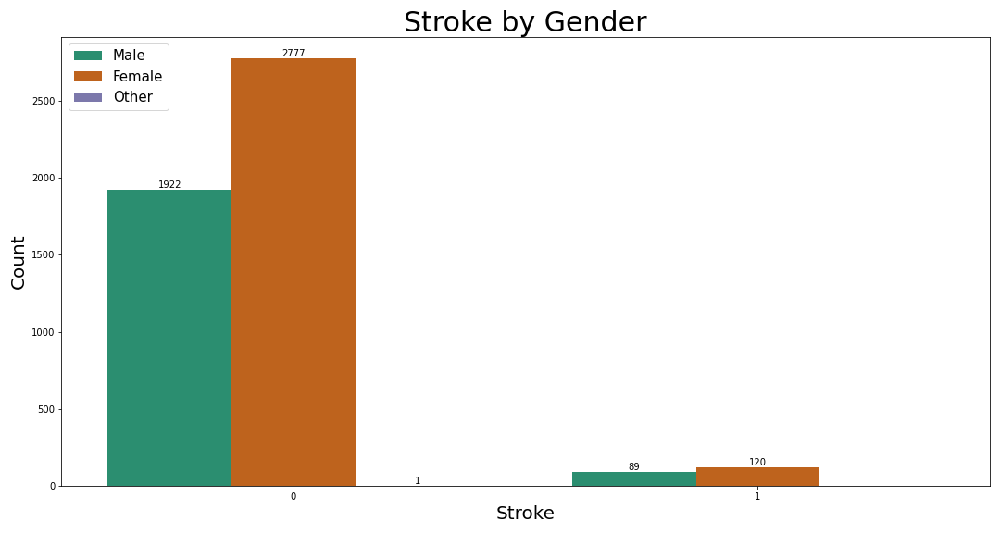

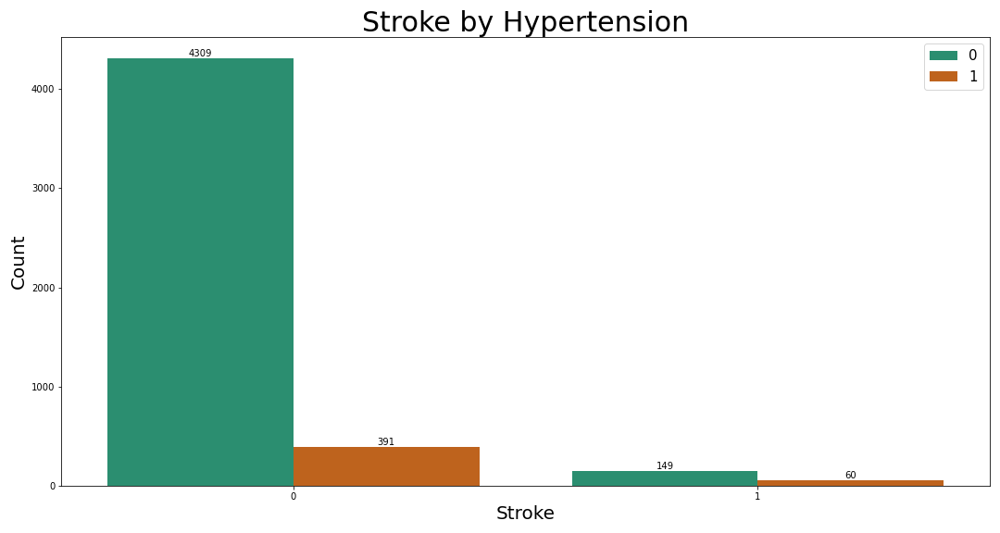

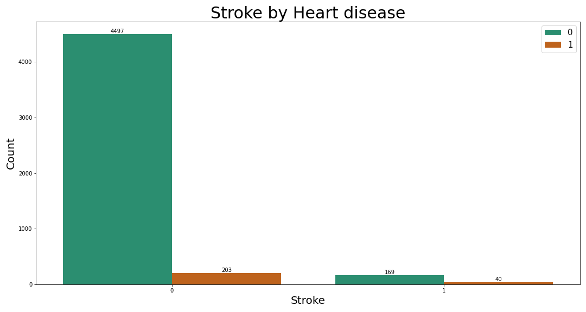

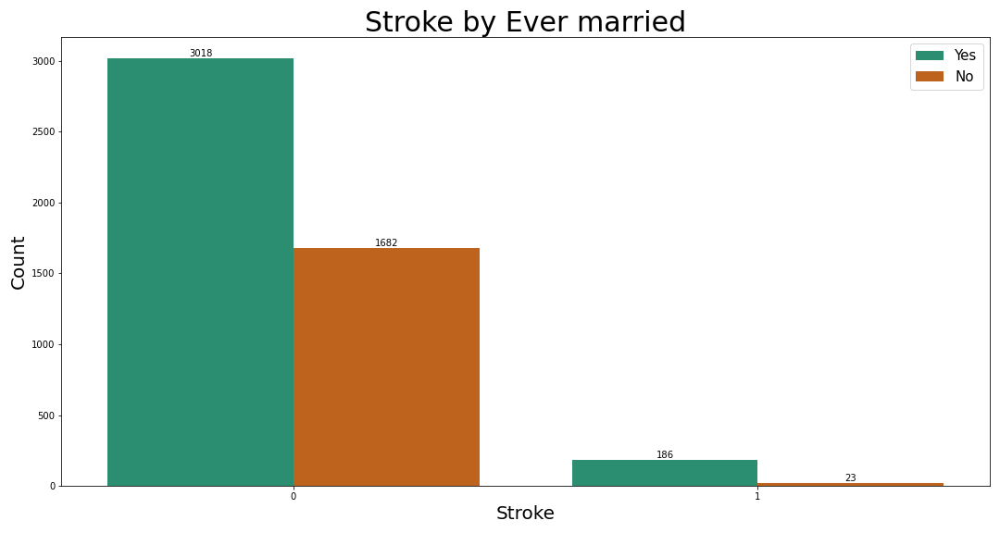

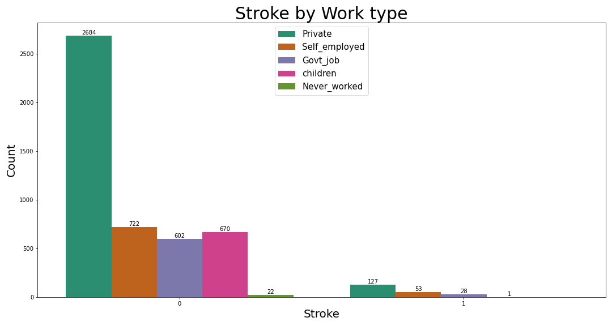

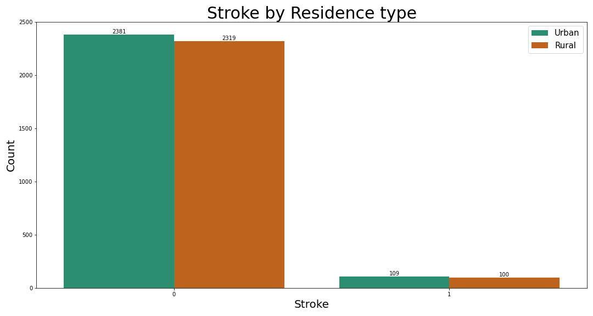

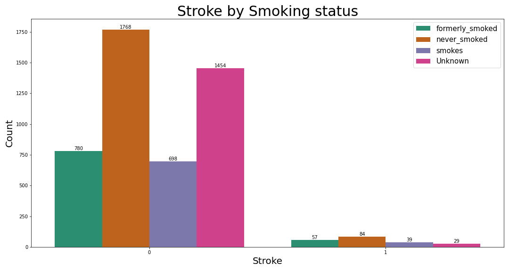

Key Takeways: 

- this dataset is very imblanced, less than 5% of the patients have stroke
- dataset contains more female patients
- `age` is most correlated with `stroke`: 0.23
- of the stroke patients, age and stroke has a positive relationship, as you get older, you are more likely to have a stroke
- highest correlation can be observed between `bmi` and `age`: 0.33
- average glucose level peaks at around 100 and 200 among stroke patients
- of the stroke patients, most of them have BMI over 25 which is considered overweight and obese
- most patients don't have hypertension; less than 30% of the stroke patients have hypertension
- most of the patients who have had a stroke do not have any heart diseas
- ratio is at about 2:1 for being married or had been married; of the stroke patients, about 89% are married
- most patients work in private sectors and has the most stroke patients
- residence type: rural or urban area does not affect the risk of stroke
- most patients have never smoked: stroke patients that have never smoked is at around 40% and those formerly smokes or smokes is around 46%

### Conclusions and Recommendations

Model Results

| Model                                | Recall | Accuracy |
|--------------------------------------|--------|----------|
| Logistic Regression                  | 0.6154 | 0.7948   |
| K-Nearest Neighbors                  | 0.2692 | 0.8746   |
| K-Nearest Neighbors w/GridSearch     | 0.1154 | 0.9072   |
| Random Forests                       | 0.0    | 0.9487   |
| Random Forests w/GridSearch          | 0.0    | 0.9495   |
| Support Vector Machines              | 0.5962 | 0.7866   |
| Support Vector Machines w/GridSearch | 0.6154 | 0.7891   |
| AdaBoost                             | 0.0    | 0.9430   |
| AdaBoost w/GridSearch                | 0.0192 | 0.9438   |

Confusion Matrix

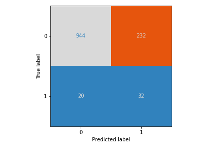

While prediciting stroke, we want to minimize false negatives, therefore optimize the recall score. Out of all the models, Logistic Regression would be the best model with a recall score of 61.5%. In terms of the accuracy score, Random Forests and AdaBoost performed the best. However, these models have the lowest recall scores. 

This model still needs improvement since there are 20 false negatives. However, medical diagnosis should not just be dependent on one model. More medical tests should be ran to give correct medical diagnosis and start treatment as soon as possible if needed. 
